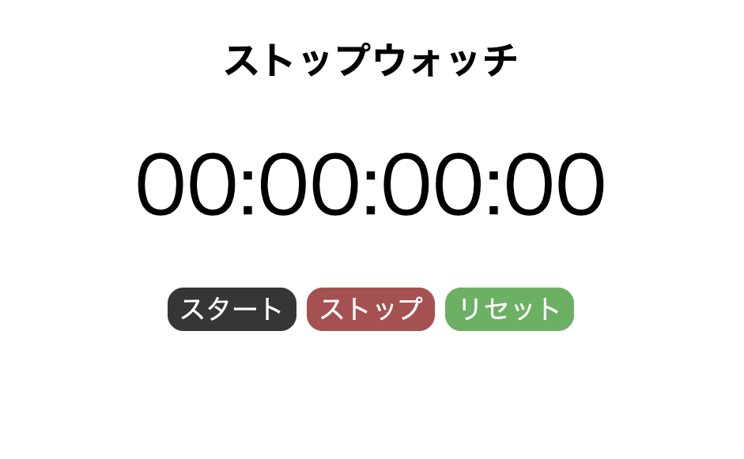
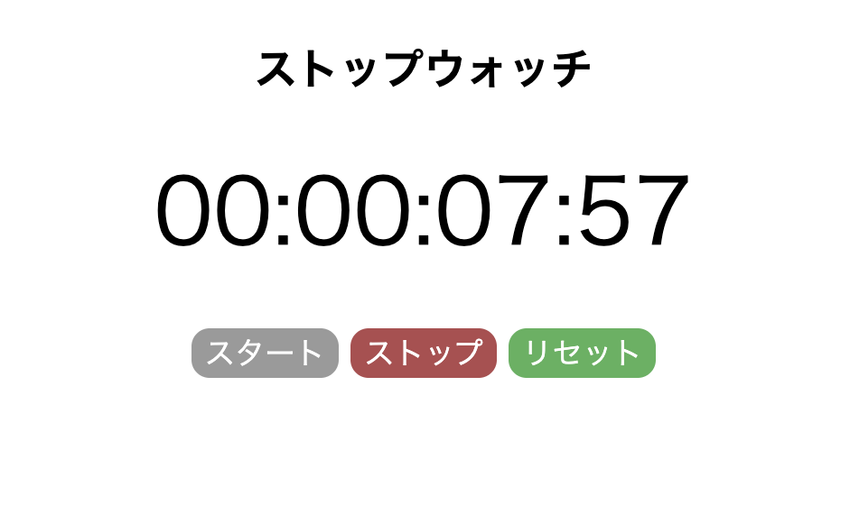
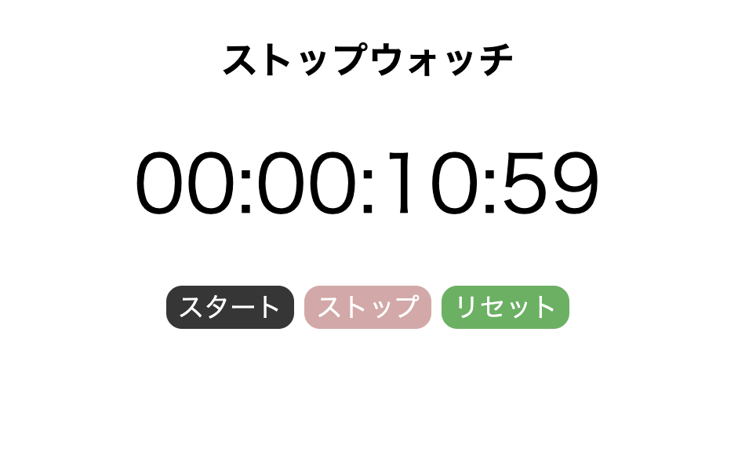

# ⏱ JavaScript Stopwatch App
A simple stopwatch application built with JavaScript that allows users to track elapsed time with start, stop, and reset functionalities.

## 🚀 Features
- 📊 Displays elapsed time in `HH:MM:SS:MS` format.
- ▶️ **Start button**: Begins time tracking.
- ⏸ **Stop button**: Pauses the stopwatch.
- 🔄 **Reset button**: Resets the stopwatch to `00:00:00:000`.
- 🚫 Button state control to prevent invalid actions (e.g., preventing multiple starts).
- 🎨 **User-friendly UI with clear visual states** (disabled buttons are styled differently).

## 🛠 Installation & Usage
### **1️⃣ Clone this repository**
```sh
git clone https://github.com/X0377/Javascript-Stopwatch.git
cd Javascript-Stopwatch
```

### **2️⃣ Open the app**
Simply open `index.html` in your browser to use the stopwatch.

## 🎮 How to Use
1. Click `スタート` to begin tracking time.
2. Click `ストップ` to pause the stopwatch.
3. Click `リセット` to reset the time.
4. The buttons dynamically enable/disable to prevent incorrect actions.

### **📌 Button Functionality**
| Button | Action |
|--------|--------|
| スタート | Starts the stopwatch |
| ストップ | Pauses the stopwatch |
| リセット | Resets the stopwatch |

## 🏗️ Implementation Details
- Uses **JavaScript `setInterval()`** for precise time tracking.
- Ensures accurate state management to prevent duplicate event triggers.
- Applied **CSS styles** to enhance UX by indicating button activation states.

## 📸 Screenshots
| Stopwatch UI | Running Stopwatch | Paused Stopwatch |
|-------------|------------------|------------------|
|  |  |  |

## 📜 License
This project is licensed under the MIT License - see the [LICENSE](LICENSE) file for details.
